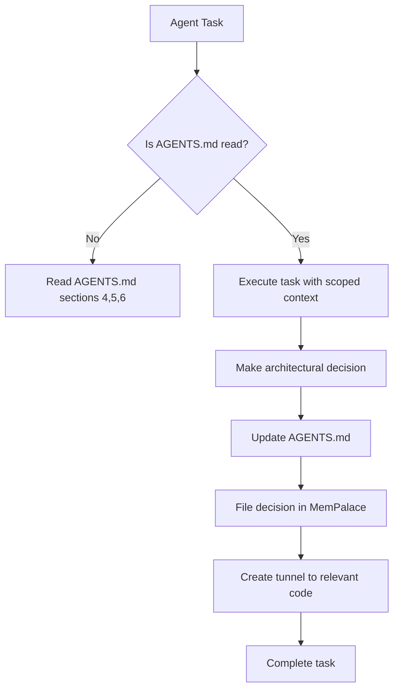

# Integrating MemPalace with Roo Code

## Overview

MemPalace is integrated into the Invasive Trace project as the primary knowledge management system for architectural decisions, research artifacts, and codebase context. This integration enables Roo Code (the AI agent) to maintain context across sessions, reference past decisions, and ensure consistency with the project's Single Source of Truth.

## Architecture

### Memory Protocol

The project follows the Agent Memory Protocol:

1. **READ**: Before any feature work, Roo Code reads AGENTS.md sections 4 (schema), 5 (API contracts), and 6 (ML registry)
2. **EXECUTE**: Roo Code decomposes tasks into atomic operations with scoped context
3. **WRITE**: After every architectural decision or pillar completion, Roo Code updates the relevant section of AGENTS.md

### MCP Integration

The integration leverages the AntiGravity / notebooklm-mcp server:

- **Notebook Name**: "gaia-atlas"
- **Notebook ID**: `b22e0bd5-8d0b-4173-a447-2b2442430d6e`
- **Local Source Set**: `/docs/research/`
- **Primary (Dev)**: `just research-sync`
- **Secondary (Prod)**: `just notebook=prod research-sync`

### Workflow



## MemPalace Implementation

### Knowledge Graph Structure

The following knowledge graph entities are maintained:

- **Wings**: `wing_code`, `wing_research`, `wing_decisions`, `wing_project`
- **Rooms**: `backend`, `ml_pipeline`, `spatial_infrastructure`, `api_contracts`, `ml_registry`, `research_notes`
- **Drawers**: Each architectural decision, research finding, or implementation detail is stored as a verbatim drawer

### Key Tunnels

| Source | Target | Connection Purpose |
|--------|--------|--------------------|
| `wing_code/backend` | `wing_research/01-SRS.md` | Links code implementation to SRS specification |
| `wing_code/ml_pipeline` | `wing_decisions/alphaearth-benchmark` | Connects Stage 2 classifier to benchmark decision |
| `wing_code/spatial_infrastructure` | `wing_research/04-wave1-phase6-validation` | Links PostGIS schema to validation methodology |
| `wing_project/project_identity` | `wing_code/backend` | Connects project objective to implementation |

### Memory Synchronization

The following commands maintain MemPalace synchronization:

```bash
# Initialize MCP connection to Dev notebook
just research-sync

# Verify MCP connection
just research-test

# Start MCP server for VS Code integration
just research-serve

# Open gaia-atlas notebook in browser
just research-open
```

## Integration Points

### Codebase Integration

All code changes are accompanied by MemPalace updates:

1. When implementing a new feature, create a drawer in the appropriate wing/room
2. Add a tunnel connecting the code implementation to relevant research or decisions
3. Update AGENTS.md with the decision context

### Example: Stage 2 Focal Classifier

When implementing the Stage 2 Focal Classifier:

- **Drawer**: `wing_code/ml_pipeline/stage2_classifier/rf-v0.1.0` with verbatim implementation details
- **Tunnel**: Connects to `wing_decisions/alphaearth-benchmark` to document the decision to reject AlphaEarth embeddings
- **AGENTS.md update**: Section 6 (ML Model Registry) updated with `rf-v0.1.0` status

### Research Integration

All research artifacts in `/docs/research/` are automatically synchronized with MemPalace:

- `01-SRS.md` → `wing_research/srs`
- `02-ARCHITECTURE.md` → `wing_research/architecture`
- `03-DATA-DICTIONARY.md` → `wing_research/data_model`
- `alphaearth-benchmark-report.md` → `wing_decisions/alphaearth-benchmark`

## Best Practices

### When to Update MemPalace

- ✅ After every architectural decision
- ✅ After completing a pillar (Wave 0, 1, 2, etc.)
- ✅ After changing the PostGIS schema
- ✅ After updating API contracts
- ✅ After changing ML model versions
- ✅ After making decisions about AlphaEarth usage

### Anti-Patterns

- ❌ Never guess schema column names - always check Section 4 of AGENTS.md
- ❌ Never hard-code API URLs - always reference Section 5
- ❌ Never reference a model by name without checking Section 6 for the correct version
- ❌ Never modify AGENTS.md without updating MemPalace

## Validation

The integration is validated through:

1. **Code review**: Ensuring MemPalace updates accompany code changes
2. **Quality gate**: `just verify` checks for consistency between code and MemPalace
3. **Research sync**: `just research-test` verifies MCP connectivity
4. **Memory audit**: Monthly review of MemPalace to ensure completeness

## Troubleshooting

### Common Issues

| Issue | Solution |
|-------|----------|
| MCP connection fails | Run `just research-sync` then `just research-test` |
| AGENTS.md and MemPalace out of sync | Run `just research-sync` and manually update MemPalace |
| Missing tunnels | Use `mcp--mempalace--mempalace_create_tunnel` to create missing connections |
| Duplicate drawers | Use `mcp--mempalace--mempalace_check_duplicate` before filing |

### Diagnostic Commands

```bash
# Check MemPalace status
mcp--mempalace--mempalace_status

# List all wings
mcp--mempalace--mempalace_list_wings

# List rooms in a wing
mcp--mempalace--mempalace_list_rooms --wing wing_code

# Search for specific content
mcp--mempalace--mempalace_search --query "Stage 2 classifier" --wing wing_code

# Follow tunnels from a room
mcp--mempalace--mempalace_follow_tunnels --wing wing_code --room ml_pipeline
```

## Future Enhancements

- Automate MemPalace updates during CI/CD pipeline
- Create automatic tunnel generation between related code and research
- Implement MemPalace validation as part of the quality gate
- Add visualizations of the knowledge graph for team onboarding

> **Single Source of Truth**: This document is part of AGENTS.md's single source of truth. Any changes to this integration must be reflected in both this document and AGENTS.md.